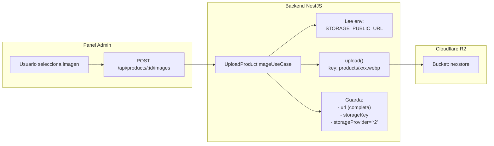
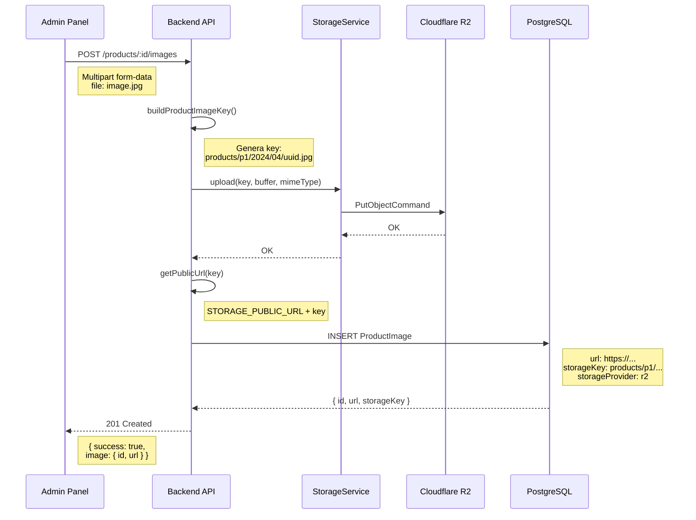
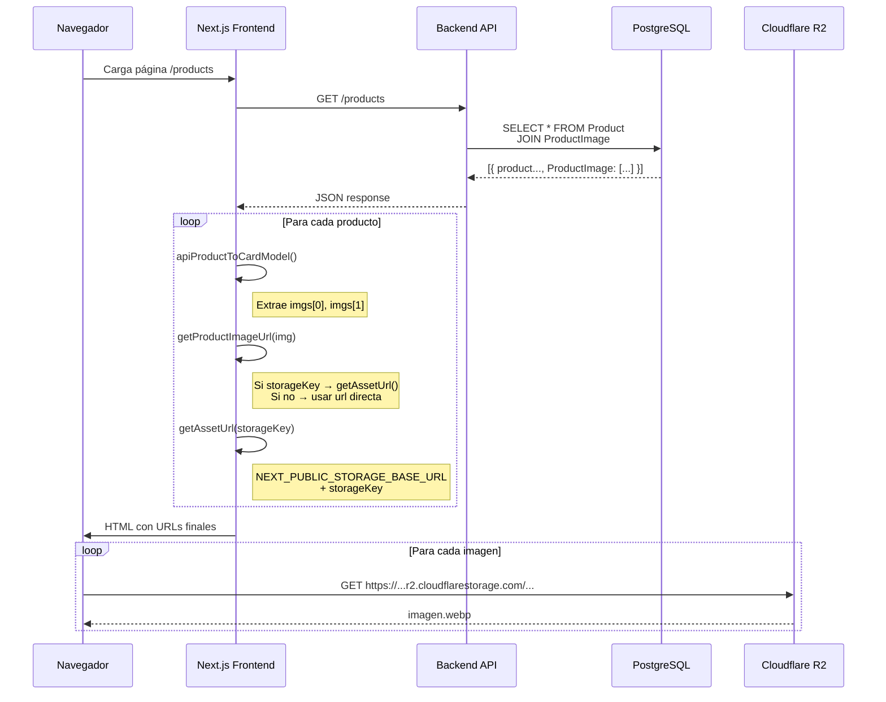

# Arquitectura de Imágenes - NexStore

## 1. FLUJO DE DATOS - Carga de Imágenes (Admin → R2 → DB)



## 2. FLUJO DE DATOS - Visualización (DB → Frontend → Usuario)

```mermaid
flowchart LR
    subgraph Database["PostgreSQL DB"]
        A[ProductImage<br/>url: https://...<br/>storageKey: products/...<br/>storageProvider: r2]
    end
    
    subgraph API["Backend API"]
        B[GET /api/products]
        C[mapper: include ProductImage]
    end
    
    subgraph Frontend["Next.js Frontend"]
        D[map-product-card-model.ts<br/>apiProductToCardModel]
        E[getProductImageUrl()<br/>lib/assets.ts]
        F[Image component<br/>next/image]
    end
    
    subgraph Browser["Navegador"]
        G[Usuario ve imagen]
    end
    
    A --> B --> C --> D
    D --> E["Prioriza storageKey<br/>si existe"]
    E --> F["src={imageUrl}"]
    F --> G
```

## 3. ESTRATEGIA DE URLS - Antes vs Después

### ❌ ANTES (Problema)
```
┌─────────────────────────────────────────────────────────┐
│  SEED guarda URL completa hardcodeada                   │
│  → "https://xxx.r2.cloudflarestorage.com/nexstore/..." │
│                                                          │
│  Frontend usa dominio diferente                         │
│  → "https://pub-xxx.r2.dev/..."                         │
│                                                          │
│  next.config.ts solo permite *.r2.dev                   │
│  RESULTADO: ❌ Imágenes bloqueadas (400)                │
└─────────────────────────────────────────────────────────┘
```

### ✅ DESPUÉS (Solución)
```
┌─────────────────────────────────────────────────────────┐
│  SEED guarda storageKey                                 │
│  → "products/men/men-01-jacket/722606-1200-auto.webp"   │
│                                                          │
│  DB guarda: storageKey + storageProvider + url (backup)   │
│                                                          │
│  Frontend construye URL dinámica:                        │
│  → NEXT_PUBLIC_STORAGE_BASE_URL + storageKey             │
│                                                          │
│  next.config.ts permite ambos dominios:                 │
│  → *.r2.dev + *.r2.cloudflarestorage.com                │
│  RESULTADO: ✅ Imágenes funcionan correctamente          │
└─────────────────────────────────────────────────────────┘
```

## 4. ARQUITECTURA DE COMPONENTES

```
┌─────────────────────────────────────────────────────────┐
│                    FRONTEND (Next.js)                    │
├─────────────────────────────────────────────────────────┤
│  ┌─────────────────┐      ┌──────────────────────┐     │
│  │  ProductCard    │──────▶│ map-product-card.ts  │     │
│  │  ProductDetail  │      │  apiProductToCard()  │     │
│  │  Slider         │      └──────────┬───────────┘     │
│  └─────────────────┘                 │                 │
│                                         ▼                 │
│  ┌─────────────────────────────────────────────────────┐│
│  │              lib/assets.ts                          ││
│  │  ┌──────────────────────────────────────────────┐   ││
│  │  │  getProductImageUrl(image)                   │   ││
│  │  │  ├─ Si storageKey existe:                   │   ││
│  │  │  │   return getAssetUrl(storageKey)         │   ││
│  │  │  ├─ Si no: usar url directa                 │   ││
│  │  │  └─ Fallback: placeholder                   │   ││
│  │  └──────────────────────────────────────────────┘   ││
│  │                                                      ││
│  │  ┌──────────────────────────────────────────────┐   ││
│  │  │  getAssetUrl(path)                           │   ││
│  │  │  return NEXT_PUBLIC_STORAGE_BASE_URL + path  │   ││
│  │  └──────────────────────────────────────────────┘   ││
│  └─────────────────────────────────────────────────────┘│
└─────────────────────────────────────────────────────────┘
                            │
                            ▼
┌─────────────────────────────────────────────────────────┐
│                    BACKEND (NestJS)                      │
├─────────────────────────────────────────────────────────┤
│  ┌──────────────────┐    ┌─────────────────────────┐ │
│  │ Upload Use Case   │───▶│ StorageConfig           │ │
│  │ (admin)           │    │ STORAGE_PUBLIC_URL      │ │
│  └──────────────────┘    │ STORAGE_BUCKET          │ │
│                           └──────────┬──────────────┘ │
│                                      │                 │
│                           ┌──────────▼──────────────┐ │
│                           │ S3CompatibleStorage    │ │
│                           │ - upload()             │ │
│                           │ - getPublicUrl(key)    │ │
│                           └──────────┬──────────────┘ │
│                                      │                 │
│                           ┌──────────▼──────────────┐ │
│                           │ Prisma DB              │ │
│                           │ ProductImage table     │ │
│                           │ - url                  │ │
│                           │ - storageKey           │ │
│                           │ - storageProvider      │ │
│                           └──────────────────────────┘ │
└─────────────────────────────────────────────────────────┘
```

## 5. SECUENCIA - Primera Carga de Imagen



## 6. SECUENCIA - Visualización en Frontend



## 7. CONFIGURACIÓN DE DOMINIOS

```
┌─────────────────────────────────────────────────────────────┐
│  next.config.ts - RemotePatterns                            │
├─────────────────────────────────────────────────────────────┤
│                                                              │
│  {                                                          │
│    protocol: 'https',                                       │
│    hostname: '*.r2.dev',          ← Para r2.dev buckets     │
│    pathname: '/**',                                         │
│  },                                                         │
│  {                                                          │
│    protocol: 'https',                                       │
│    hostname: '*.r2.cloudflarestorage.com',  ← Para S3 API │
│    pathname: '/**',                                         │
│  },                                                         │
│                                                              │
└─────────────────────────────────────────────────────────────┘

┌─────────────────────────────────────────────────────────────┐
│  Variables de Entorno (deben coincidir)                     │
├─────────────────────────────────────────────────────────────┤
│                                                              │
│  Backend (.env):                                            │
│  STORAGE_PUBLIC_URL=https://xxx.r2.cloudflarestorage.com/  │
│                                                              │
│  Frontend (.env.local):                                     │
│  NEXT_PUBLIC_STORAGE_BASE_URL=https://xxx.r2.cloud...      │
│                                                              │
│  ✅ Mismo dominio = URLs consistentes                      │
│                                                              │
└─────────────────────────────────────────────────────────────┘
```

## 8. ESTRUCTURA DE DATOS

### ProductImage (Prisma Schema)
```typescript
model ProductImage {
  id              Int      @id @default(autoincrement())
  url             String              // URL completa (backup)
  storageProvider String?  // 'r2' | 'local' | 's3'
  storageKey      String?  @unique     // path/key en storage
  contentType     String?             // image/webp
  sizeBytes       Int?                // 12345
  altText         String?             // descripción
  sortOrder       Int      @default(0)
  isPrimary       Boolean  @default(false)
  productId       String
  product         Product  @relation(fields: [productId], references: [id])
}
```

### Flujo de Decisión (getProductImageUrl)
```
                    ┌─────────────────┐
                    │  Imagen data?   │
                    └────────┬────────┘
                             │
                    ┌────────▼────────┐
                    │  ¿storageKey?   │
                    │  + provider?    │
                    └────────┬────────┘
                             │
           ┌─────────────────┼─────────────────┐
           │ SÍ              │ NO              │
           ▼                 ▼                 │
    ┌─────────────┐   ┌─────────────┐        │
    │ getAssetUrl │   │  ¿url HTTP?   │        │
    │ (key)       │   └──────┬──────┘        │
    └──────┬──────┘          │                 │
           │        ┌───────┴───────┐        │
           │        │ SÍ            │ NO      │
           │        ▼               ▼         │
           │   ┌─────────┐   ┌─────────────┐  │
           │   │ return  │   │ getAssetUrl │  │
           │   │ url     │   │ (url path)  │  │
           │   └─────────┘   └─────────────┘  │
           │                                 │
           └────────────────┬────────────────┘
                            ▼
                   ┌─────────────────┐
                   │  return URL     │
                   │  final          │
                   └─────────────────┘
```
