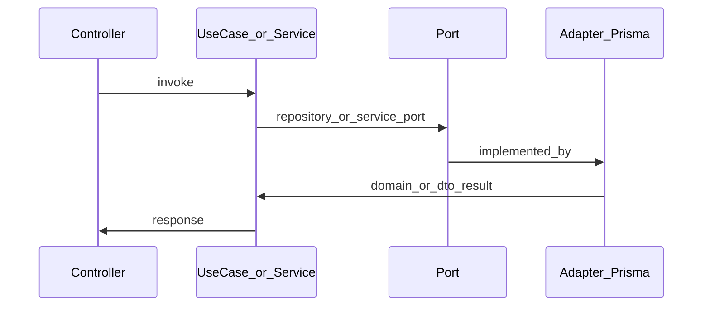

# Arquitectura del backend (NestJS + Prisma)

## Principio

**Hexagonal por módulo**: cada bounded context (auth, users, products, orders, payments, admin, health) tiene sus capas locales. Solo lo genuinamente compartido entra en `shared/`.

## Árbol oficial

Cada módulo incluye **siempre** las carpetas `domain/`, `application/` e `infrastructure/` (pueden contener solo `.gitkeep` hasta que haya código).

```
src/
  app.module.ts
  main.ts
  shared/
    shared.module.ts          # @Global() — exporta PrismaService
    domain/                   # tipos/puertos realmente transversales (vacío por defecto)
    application/              # helpers de aplicación compartidos (vacío por defecto)
    infrastructure/
      prisma/prisma.service.ts
      auth/                   # guards, decorators, jwt-payload, permissions
  modules/
    auth/
      domain/
      application/            # AuthService (fachada; use cases futuros)
      infrastructure/http/      # auth.controller.ts, dto/
      auth.module.ts
    users/
      domain/
      application/
      infrastructure/http/
      users.module.ts
    products/
      domain/ports/             # ProductRepositoryPort
      application/use-cases/
      infrastructure/http/      # products, categories, countries
      infrastructure/persistence/
      products.module.ts
    orders/
    payments/
    admin/
    health/
      domain/
      infrastructure/http/health.controller.ts
```

Ver árbol detallado y auditoría en [BACKEND_AUDIT.md](./BACKEND_AUDIT.md).

## Dependencias permitidas

| Capa            | Puede importar                    | No puede importar        |
|-----------------|-----------------------------------|---------------------------|
| domain          | domain, shared/domain             | Nest, Prisma, HTTP        |
| application     | domain, application, shared       | PrismaClient, controllers |
| infrastructure  | application, domain, shared, Nest | —                         |
| shared          | Nest (infra), Prisma              | lógica de un feature      |

## Flujo de una petición HTTP



Los módulos **auth, users, orders, payments, admin** usan hoy un **application service** (`*Service`) que concentra Prisma y reglas; la meta es sustituirlos por **use cases** y **puertos** siguiendo el patrón del módulo **products** (ver [BACKEND_AUDIT.md](./BACKEND_AUDIT.md) §3).

## Módulos Nest

- `AppModule` importa `SharedModule`, `JwtModule`, y cada `*Module` de `modules/`.
- Guards globales (`JwtAuthGuard`, `RolesGuard`) se registran en `AppModule`.
- Cada feature module declara sus controllers y providers; importa `SharedModule` si necesita `PrismaService`.
